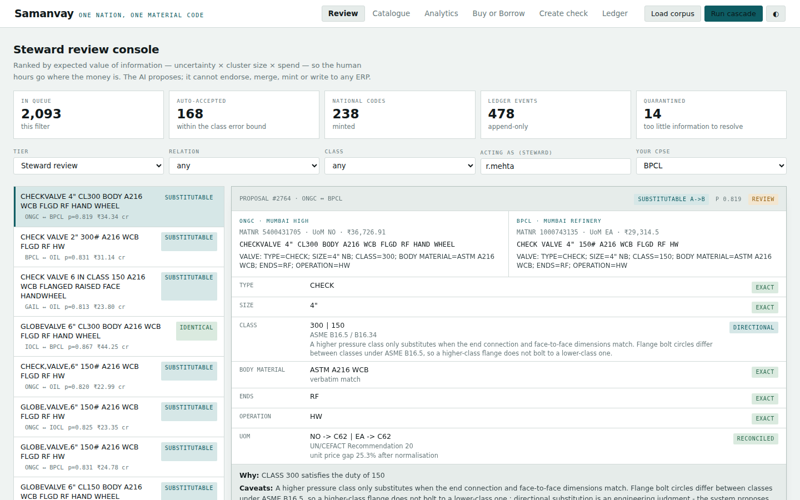

# Samanvay — One Nation, One Material Code

*Similarity proposes. Standards decide. Stewards approve. The ledger remembers.*

Samanvay is a working implementation of **SIH26099** — AI-driven standardization
and harmonization of material codes across India's Central Public Sector
Enterprises (Oil & Gas, Power, Steel, Mining, Heavy Engineering). It takes
material master records from multiple CPSEs, finds which ones describe the
same or functionally equivalent item, types the relationship precisely
(identical / equivalent / substitutable / variant / distinct — never a single
fuzzy "similarity score"), mints a National Material Code anchored to India's
existing NATO Codification Bureau (NCB 72) numbering, and routes every
decision through a human steward with a dual-CPSE-key endorsement and an
append-only governance ledger. Nothing merges without evidence, a citation to
a standard, and a named person's approval.

The full design rationale — why a fuzzy match score is the wrong abstraction,
the nine-stage cascade, the standards knowledge graph, calibrated
accept/review/reject decisions with a stated error bound, the federated
CPSE-node deployment model, the economics model, the 36-hour build plan, the
8-minute demo script, and a 12-question judge Q&A bank — is in the companion
design blueprint: **https://claude.ai/artifact/VnRKYHKzveBmi2euCof48z**.
This repository is that design, built.



## Quickstart

Zero external dependencies. Python 3.9+ and the standard library are enough.

```bash
make demo          # reset DB, load the synthetic corpus, run the cascade, start the server
```

Then open `http://127.0.0.1:8000` for the review console, catalogue, analytics,
Buy-or-Borrow screen, create-time duplicate check, and governance ledger.
`PORT=8080 make demo` to use a different port. `make help` lists every target.

Without `make`:

```bash
python3 scripts/reset_demo.py      # reset + seed + run the cascade (a few seconds)
python3 -m samanvay.server         # serve on :8000 (SAMANVAY_PORT to change it)
```

## Why zero dependencies

The problem statement itself does not mandate any package ecosystem — it asks
for AI/ML/NLP capability and ERP integration, not a specific stack. PyPI
access was blocked by network policy in the sandbox this was built in, so the
whole system is written to the Python standard library: `http.server` for the
API, `sqlite3` for storage, hashed n-gram embeddings, and a from-scratch
gradient-descent logistic reranker. `numpy` is used opportunistically where
already present but nothing requires it.

This is not only a workaround. A CPSE edge node that runs entirely on the
standard library, with no outbound calls of any kind, is a real deployment
mode this design already argues for (see "federated deployment" in the
blueprint) — an air-gapped, sovereign node is a stronger story for critical
national infrastructure than a system that phones out to a hosted model API.

Where real pip access exists (a laptop, the actual hackathon venue, a
production rollout), the upgrade path is a config change, not a rewrite:

```bash
pip install -r requirements-optional.txt --break-system-packages
export SAMANVAY_EMBEDDING=st       # real sentence-transformer bi-encoder
export SAMANVAY_RERANK=cross       # real cross-encoder reranker
python3 -m samanvay.server
```

`samanvay/server_fastapi.py` mounts the identical route table on FastAPI/ASGI
for teams that want auto-generated OpenAPI docs; it is written to exactly
mirror the stdlib server and is otherwise untouched by this note.

## Architecture at a glance

Nine stages, recall-first funnel then a precision-first gate:

```
00 ingest & profile      completeness scoring, quarantine, engineered-item exclusion
01 normalise             mined abbreviation lexicon, UoM algebra, pack size
02 extract attributes    class-conditioned, grammar-first, schema-constrained
03 block + ANN recall    multi-key union, cross-CPSE only
04 bi-encoder score      recall-first cutoff (structural pairs always survive it)
05 cross-encoder rerank  attribute-serialised pair input
06 constraint solver+KG  hard conflicts, standards equivalence closure
07 conformal decision    accept / review / reject with a per-class error bound
08 correlation cluster   transitivity repair under steward constraints
09 mint + queue          NMC minting, golden records, value-ranked review queue
```

Five typed relations, not one similarity score: **IDENTICAL**, **EQUIVALENT**,
**SUBSTITUTABLE** (directed — a satisfies b's duty, not the reverse),
**VARIANT_OF** (same family, different size — rolled up for spend, never
merged), **DISTINCT** (a named, cited conflict). A sour-service qualifier
(NACE MR0175) stated on only one of two otherwise-identical records is
**UNDETERMINED**, never silently matched — absence means unknown, not "not
required".

```
samanvay/
  core/         the cascade stages: text, classify, extract, kg, uom, embed,
                blocking, features, constraints, conformal, cluster, scorer,
                labels, nmc, render, evidence, economics, federation, cascade
  store/        sqlite3 schema, the append-only hash-chained ledger, the
                repository layer
  api/          route table, handlers, the service layer (endorse/merge/
                unmerge/duplicate-check/buy-or-borrow/analytics/federation)
  connectors/   SAP (MARA/MAKT/MARC/MBEW/EINA via MDG-M change requests,
                never a direct MATNR write) and a generic CSV/JSON connector
  web/          the six-view vanilla-JS console (no build step, no framework)
  server.py     stdlib http.server adapter
  server_fastapi.py   optional ASGI adapter, identical routes
data/           the standards knowledge graph, class dictionary, UoM table,
                abbreviation lexicon (seed + corpus-mined)
scripts/        seed.py (synthetic corpus + ground truth), benchmark.py,
                reset_demo.py
tests/          stdlib unittest suite
```

## Testing and benchmarking

```bash
make test     # ~100 unit tests, stdlib unittest, runs in well under a second
make bench    # measures the cascade against planted ground truth, ~5 seconds
```

`make test` covers the primitives directly: text normalisation (the imperial-
fraction and glued-notation regressions), the standards graph (short-alias
matching, directed/partial equivalence, non-inferable service qualifiers),
the constraint solver on six named adversarial pairs (metric vs. unified
thread, bearing bore codes one digit apart, cable armour equivalence, NACE
non-inferability), calibrated decision tiers, the Verhoeff check digit, and
the ledger's append-only guarantee and replay-reversibility proof.

`make bench` is the judge-facing evidence: it generates a synthetic corpus
with deliberately planted duplicate groups, quarantine cases, and exclusion
cases (`scripts/seed.py`), runs the real cascade with no database involved,
and reports blocking recall (the hard ceiling), relation-typing recall
(tier-agnostic — did the solver get the relationship right at all), the
fully-unattended auto-accept precision/recall, cluster purity (the
mega-cluster check that pairwise F1 alone would hide), and the same six named
adversarial cases as the test suite. It asserts hard invariants at the end —
zero false-positive auto-merges, zero cross-group contamination, every named
case correct — and exits non-zero under `--strict` if any of them break,
which is exactly how a real regression was caught and fixed while this
benchmark was being written (see below).

## A benchmark caught a real bug

Worth stating plainly rather than only in a commit log: writing `make bench`
surfaced a genuine classification bug before any demo did. Glued class-name
text — `"GATEVALVE"` with no space, ordinary ERP data-entry noise that the
synthetic corpus deliberately includes — matched no class keyword, fell
through to `GENERIC`, and `GENERIC` has almost no blocking attributes. That
let a 2" valve and an 8" valve auto-merge. The fix (`samanvay/core/classify.py`,
`samanvay/core/extract.py`) adds a space-stripped fallback match for
multi-word keywords, used only when word-boundary matching finds nothing, so
it cannot change behaviour on any description that was already classifying
correctly. `tests/test_classify.py` pins it down as a named regression, and
`make bench` now reports zero false-positive auto-merges and 100% cluster
purity on the same corpus. If you take one thing from this section: the
benchmark is not decoration, run it.

## Honest limits

- The corpus is synthetic (`scripts/seed.py` says so at the top of its own
  output) — every CPSE name, material number, price and stock figure is
  invented for demonstration. Real CPSE data needs a real pilot.
- The bi-encoder is hashed n-gram features, not a trained semantic model —
  strong enough for exact and near-exact text, weaker on paraphrase. See
  "Why zero dependencies" for the one-line upgrade.
- India's NCB code (72) and the National Material Code's NSN-shaped layout
  should be confirmed against ACodP-1 / ddpdos.gov.in before anything here is
  presented as production-ready against the real national codification
  registry.
- The SAP connector writes MDG-M change requests and a Z-table cross-reference
  only — it never writes MATNR directly, and `mode="mock"`/`mode="csv"` are
  what this build has actually exercised; `mode="odata"` is written against a
  real MDG service contract but untested against one.
- Conformal calibration needs real steward decisions to mean what it claims;
  a freshly reset demo database runs on class-pooled priors until enough
  decisions accumulate per class (`samanvay/core/conformal.py` reports this
  honestly via each decision's `fallback` flag rather than hiding it).
